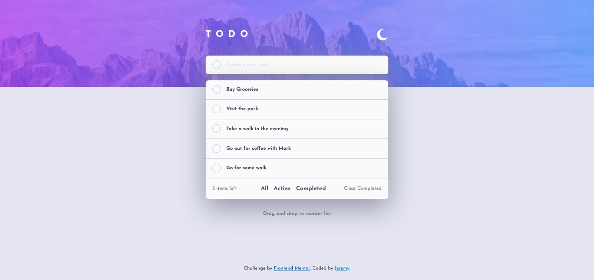
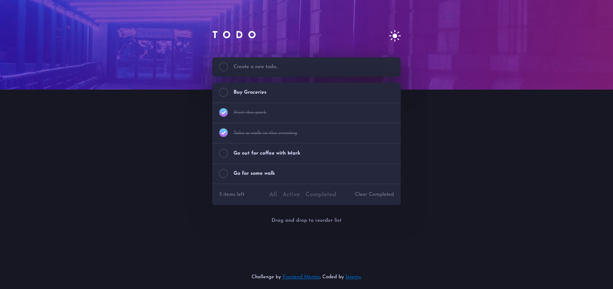
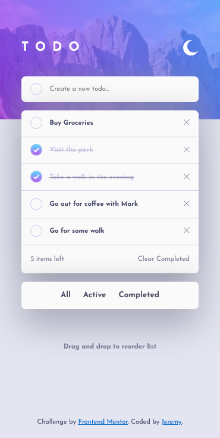
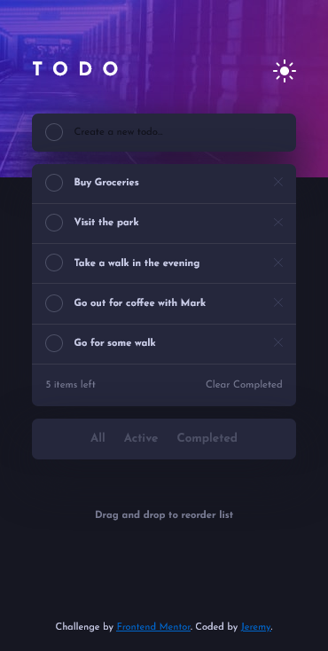

# Frontend Mentor - Todo app solution

This is a fullstack solution to the [Todo app challenge on Frontend Mentor](https://www.frontendmentor.io/challenges/todo-app-Su1_KokOW).\
Frontend Mentor challenges help you improve your coding skills by building realistic projects.

## Table of contents

- [Overview](#overview)
  - [The challenge](#the-challenge)
  - [Screenshot](#screenshot)
  - [Links](#links)
- [My process](#my-process)
  - [Built with](#built-with)
  - [What I learned](#what-i-learned)
  - [Continued development](#continued-development)
  - [Useful resources](#useful-resources)
- [Author](#author)
- [Acknowledgments](#acknowledgments)

## Overview

### The challenge

Users should be able to:

- View the optimal layout for the app depending on their device's screen size
- See hover states for all interactive elements on the page
- Add new todos to the list
- Mark todos as complete
- Delete todos from the list
- Filter by all/active/complete todos
- Clear all completed todos
- Toggle light and dark mode
- **Bonus**: Drag and drop to reorder items on the list

### Screenshot

- **Desktop view**:

  
  

- **Mobile view**:

  
  

### Links

- Solution URL: [Add solution URL here](https://your-solution-url.com)
- Live Site URL: [Add live site URL here](https://your-live-site-url.com)

## My process

### Built with

1. **Frontend**:

- HTML
- CSS
- JavaScript

2. **Server side**

- Express framework
- Mongo

3. **Concepts**

- CSS custom properties
- Flexbox
- Mobile-first workflow
- Backend architecture - hybrid architecture
- Database architecture

### What I learned

Skills I have applied:

1. Implementing a design to a code base
2. Basic HTML knowledge and layout including semantics
3. Use of flexbox in layout using CSS
4. Use of custom properties in CSS
5. Manipulation of DOM using Javascript
6. Application of Fetch API in updating the client side content
7. Persistent UI(dark/light mode) by using the browser tehcnologies available eg.localstorage
8. Applying NodeJS in the backend server with express framework
9. Organise the modules as per each specific purpose eg routers and controllers
10. Use of templating technologies i.e. ejs for dynamic applications
11. Design data storage layout in for ease of querying
12. Using non-relational databases
13. Creating, Reading, Updating and deleting data using non-relational database
14. Using version Control in keeping up to date with the changes of the development
15. Deployment of a fullstack application

**Other learnings**

I am proud of these snippets:

---

```js
const foundTask = data.tasks.find((item) => item.id === itemId);
try {
  foundTask && foundTask.completed === true
    ? (foundTask.completed = false)
    : (foundTask.completed = true);
  // console.log(foundTask);
  const jsonFile = fs.createWriteStream("src/data/tasks.json");
  // Write the modified buffer to the file
  jsonFile.write(JSON.stringify(data));
  // Close the file.
  jsonFile.end();
} catch (error) {
  console.log(error);
}
```

The purpose is to check whether the checkbox is checked or not and update the data accordingly. This is by use of ternary operator.

---
```js
let itemId = checkBox.getAttribute("data-id");
// console.log(itemId);

let complete_item;
// update the task : done or not done
itemSelected.classList.contains("checked-item")
  ? (complete_item = {
      id: itemId,
      task: newTask.value,
      completed: true,
    })
  : (complete_item = {
      id: itemId,
      task: newTask.value,
      completed: false,
    });

fetch(`/update/${itemId}`, {
  method: "PATCH",
  headers: { "Content-Type": "application/json" },
  body: JSON.stringify(complete_item),
})
  .then((response) => response.json())
  .then((data) => {
    console.log(data);
  });
```

The code above, checks whether the item is checked or not and uses fetch API to update on the server.

---

```html
<p>
  <span>
    <% let count=0; %> <% for (var i=0; i < tasks.length; i++) {%> <% if
    (!tasks[i].completed) { %> <% count++; %> <% } %> <% } %> <%= count %>
  </span>
  items left
</p>
```

The above is for keeping up to date with the number of tasks left after checking the checkbox.

---

If you want more help with writing markdown, we'd recommend checking out [The Markdown Guide](https://www.markdownguide.org/) to learn more.

### Continued development

On future development would be to focus on authentication, adding the client capability to create an account and have his/her own tasks.

### Useful resources

## Author

- Website - [Add your name here](https://www.your-site.com)
- Frontend Mentor - [@Jeremy Mwangi](https://www.frontendmentor.io/profile/JeremyWarui)
- Twitter - [@Jeremy Mwangi](https://www.twitter.com/jerywarne7)
- Github - [@JeremyWarui](https://github.com/JeremyWarui)

## Acknowledgments
